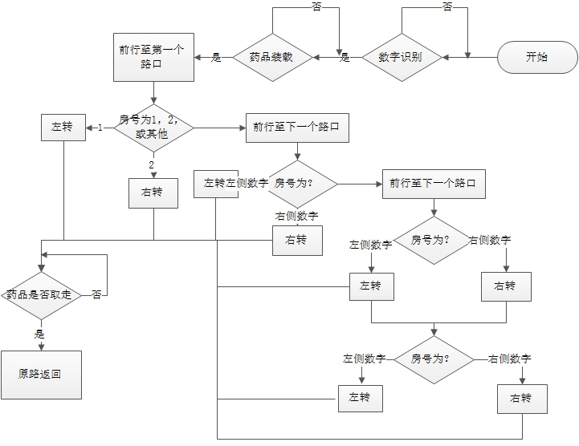
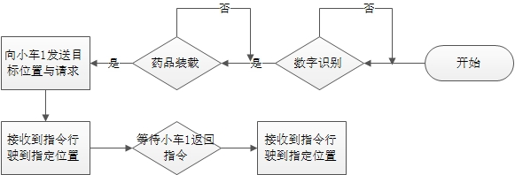
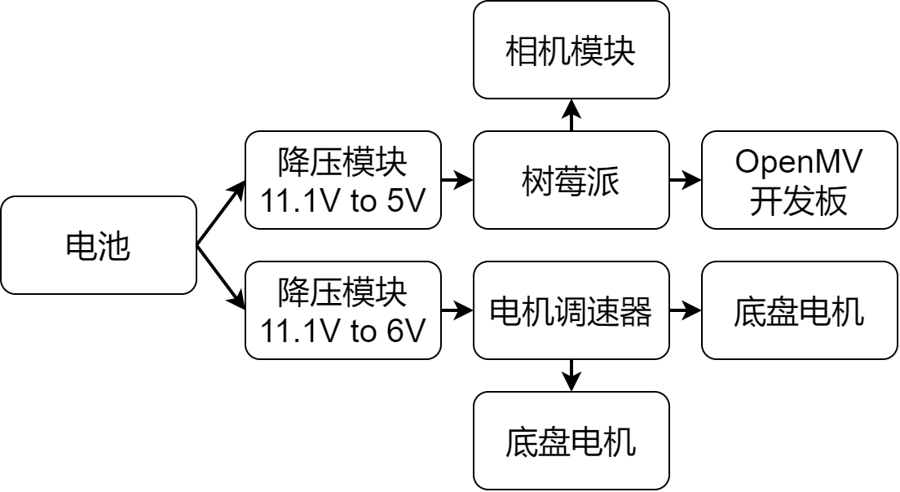
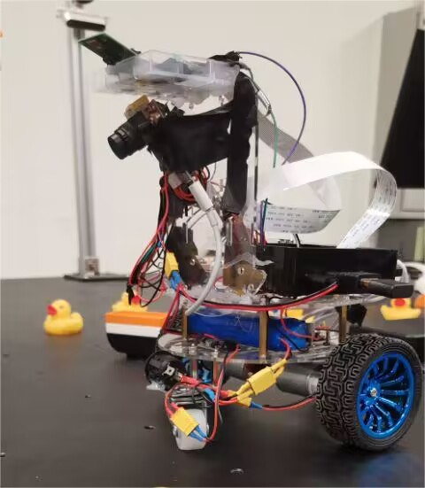
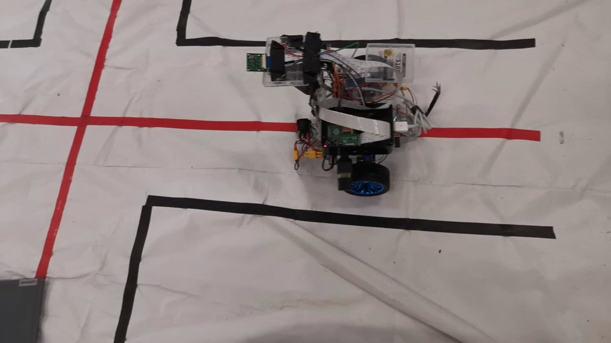

# 2023-elec-competition-F-drug_car-final

通过树莓派与openmv设计

（理论上）实现了要求的全部功能

代码部分：高自然，徐思琪；机械部分：徐思琪，周弘毅。
        

## 报告

摘要：本智能送药小车系统采用树莓派作为主控，K210 作为视觉系统主要元件来实现多组数字识别，通过 7路灰度传感器、openMV视觉识别与PID速度闭环算法相结合来实现循迹、转弯等功能。

关键词：openMV，K210，串口通信

### 目标定位

#### 实现数字识别功能

#### 通过视觉识别模块与主控相结合实现小车巡线直线行走、十字路口转弯、黑线处停止等功能

#### 通过机械部分和电路系统设计搭建小车硬件模块

#### 通过LED、称重模块等实现小车辅助功能

#### 实现单个小车各个部件之间的信号传输、两个小车之间信号传输

1. 实现数字识别功能。
2. 通过视觉识别模块与主控相结合实现小车巡线直线行走、十字路口转弯、黑线处停止等功能。
3. 通过机械部分和电路系统设计搭建小车硬件模块。

4. 通过LED、称重模块等实现小车辅助功能。

5. 实现单个小车各个部件之间的信号传输、两个小车之间信号传输。

### 系统设计思路

#### 小车1的程序设计思路

首先进行目标病房房号的识别，前行到第一个十字路口后判断是否为1，2号病房，如为1，2号病房则进行左右转，到达病房后执行等待、返航操作，否则前行至下一十字路口，进行数字识别，如为目标数字则进行对应转向，到达病房后执行等待、返航操作，否则前行至T字路口，进行数字识别后进行对应转向，前行至下一T字路口，进行数字识别后进行对应转向，到达病房后执行等待、返航操作。

在识别到病房位置并转弯后，首先进行虚线的识别，卸载后启动返回程序按照记忆路线返回。

#### 小车2的程序设计思路

首先进行目标病房房号的识别，等待小车1指令，行驶到指定位置，之后等待小车1指令，行驶到指定位置。

### 具体模块设计方案论证与实现

#### 数字识别设计

##### 设计方案论证

###### 方案一：采用OpenMV 的多模板匹配

由于openMV镜头视角窄，神经网络处理能力差,且模板易受复杂环境与倾角干扰，此方案弃用。

###### 方案二：采用树莓派结合openCV实现基于 K210 的硬件加速神经网络的图像识别

##### 方案实现

最终采用方案二实现数字识别。首先将采集到的图片进行压缩，并二值化处理，将二值化处理后的图像进行形状识别，将识别出的形状进行筛选，选出边值为4的形状，进行拉伸，并切割为大小为100*60的长方形，与预训练处理的图片进行匹配，当匹配值低于20000000时返回对应值。但是由于该程序每次仅可进行单一数字识别，故将图像左3/2处与右3/2处进行切割，将获取到的图像作为结果分别进行识别。识别效果较好。

#### 视觉识别模块与主控设计

##### 设计方案论证

###### 方案一：通过现有循迹模块实现循迹

由于场地由红线放在白底上构成，加之反光等因素影响，使用普通红外循迹模块无法实现精准识别功能。此方案弃用。

###### 方案二：通过二值化图像后使用霍夫变换查找图像中的所有直线实现巡线功能，通过色块识别实现十字路口识别功能

采用openMV,通过二值化图像后使用霍夫变换查找图像中的所有直线实现巡线功能，由于openMV自带颜色阈值机器视觉调节器，可以将红色的阈值设的非常精细，因此效果非常好。同时，对图像所有阈值像素进行Theil-Sen线性回归计算，通过最小二乘法进行，通常速度较快，凭借计算图像中所有阈值像素的斜率的中位数来实现。只要阈值转换后的像素数量较少，即使在高达30％的阈值像素是异常值的情况下也依然有效，本方案鲁棒性好。

采用openMV，划分ROI区域为屏幕上方区域，红色阈值的最大色块，设定当最大色块设定当最大色块的宽度达到临界值时即为十字路口，效果不错。

然而，当将两个效果均不错的方案拼接在一起的时候，此方案却出现了致命的缺陷：由于巡线功能的实现有赖于直线的霍夫变换，因此，为了小车行走的足够直，硬件设施应将open MV的倾角调得较小（略小于45度），使得镜头能够看得足够远。然而十字路口的识别却要求硬件设施上将镜头尽量平置，才可以在恰好到达十字路口时反馈相应的信号，否则，得依靠延迟来实现小车到达十字路口之后反馈转弯信号，会导致小车控制不准。因此，两方案合并时，对硬件设施的放置需求上出现了矛盾。同时，在图像处理上，巡线功能需要将图像进行二值化，而色块识别功能需要采用原来的彩色图像摄像头同时处理两个图像，导致openmv反应不够灵敏，两个控制相互干扰，此方案弃用。 

###### 方案三：通过二值化图像后使用霍夫变换查找图像中的所有直线实现巡线功能，通过七路灰度传感器实现十字路口识别功能

巡线方案同方案二。

十字路口识别上使用七路灰度传感器，布局在小车底座，发光源采用高亮聚光LED，接收管对不同反射光的强弱对比处理，比普通红外传感器抗干扰能力要强很多，效果不错。

###### 方案四：通过色块识别和ROI区域划分同时实现十字路口识别功能}

将巡线功能和十字路口识别功能统一采用色块识别来实现。将open MV拍摄所得的视野区域分为若干个感兴趣区域roi，以此判别需要直行、左转还是右转。

##### 方案实现

最终采用方案三实现视觉识别，通过设置定时器来使端口产生 PWM 控制电机驱动，并通过控制差速结合PID算法来实现转向以及小车闭环控制功能。

#### 机械部分和电路系统设计

小车的底盘采用两导轮+两动力轮的设计，一方面是因为两个动力轮的驱动方式简单，另一方面是这样转向也很方便高效，几乎是不能使用异形底盘（例如麦克纳姆轮、全向轮等）的情况下最方便的设计。
以下是小车的机电连线图：

小车整体外观图：

整车的布线采用模块化可更换设计，电源线的连接大量使用XT30电源接口，方便更换和检修。

由于我们用于数字识别和巡线的摄像头需要安装在较高位置，在我们的小车前方安装了一个高高的支架，并且用六角柱和热熔胶固定，用于安装摄像头模块。

### 小车辅助功能设计

#### 称重模块设计

 为了完成药的称重功能，我们使用了电子称常用的应变片作为传感器，但是由于应变片输出的是很精细的模拟信号，并且树莓派不具有ADC功能，我们选用了一个经常和应变片搭配使用的HX711 ADC芯片，它可以实现24位的ADC采样，并且以数字信号的形式输出，可以直接用树莓派的GPIO引脚功能读取到。读取到的信号是一个$0 \sim 2^{24}$之间的整数，与物品的真实重量成线性关系，故需要对其进行校准，拟合出一条$y=ax+b$形式的线性函数，其中$x$是读取到的整数，$y$是真实的物品质量。这样，我们就实现了称取药物质量的功能，能够做到在放置了200g药物之后小车再启动的功能。

#### 单个小车各个部件之间的信号传输、两个小车之间信号传输功能实现

##### 蓝牙模块设计

以小车2为蓝牙服务器，等待客户端小车1的请求并控制openMV进行小车姿态操控。

##### 串口通信模块设计

以树莓派为服务器，设置串口波特率为19200，等待openMV回传请求数字识别与路线判定。

#### 指示灯实现

通过将LED灯连接到树莓派的GPIO口上即可实现指示灯的亮暗。

### 测试

 实验仪器：智能小车、计时器、200g模拟药物、比赛用场地、打印体数字。
 实验内容：在模拟真实比赛场地上依次进行近端、中端、远端的测试。测试效果良好。

